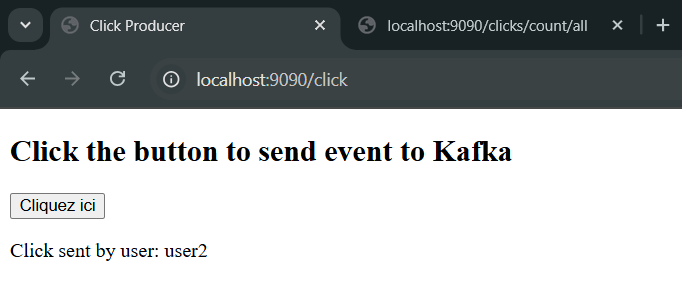
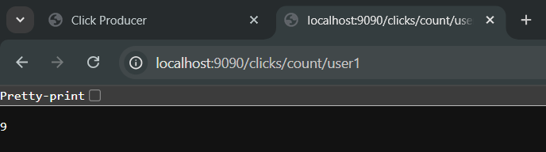
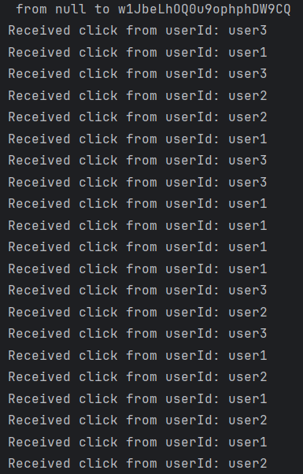

# Click Counter App

This application demonstrates a complete Kafka Streams pipeline for tracking click events.


## Screenshots

-------------------

---------------
-------------------


-----
-------------------

-----------
---------

```
The End